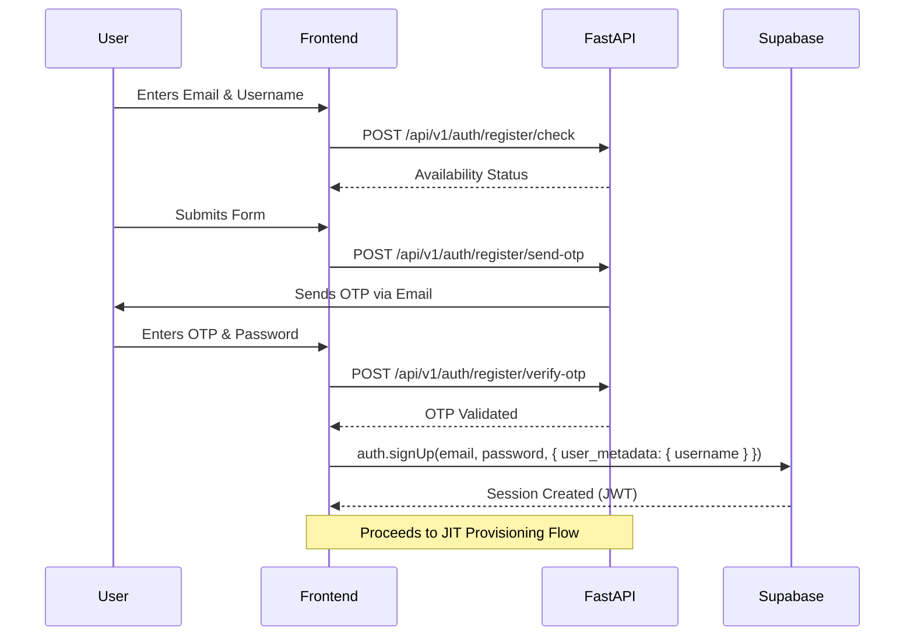
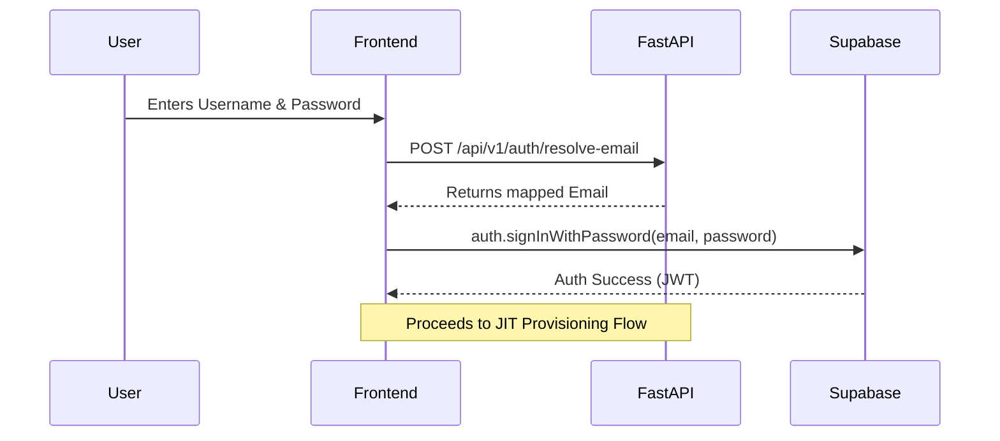
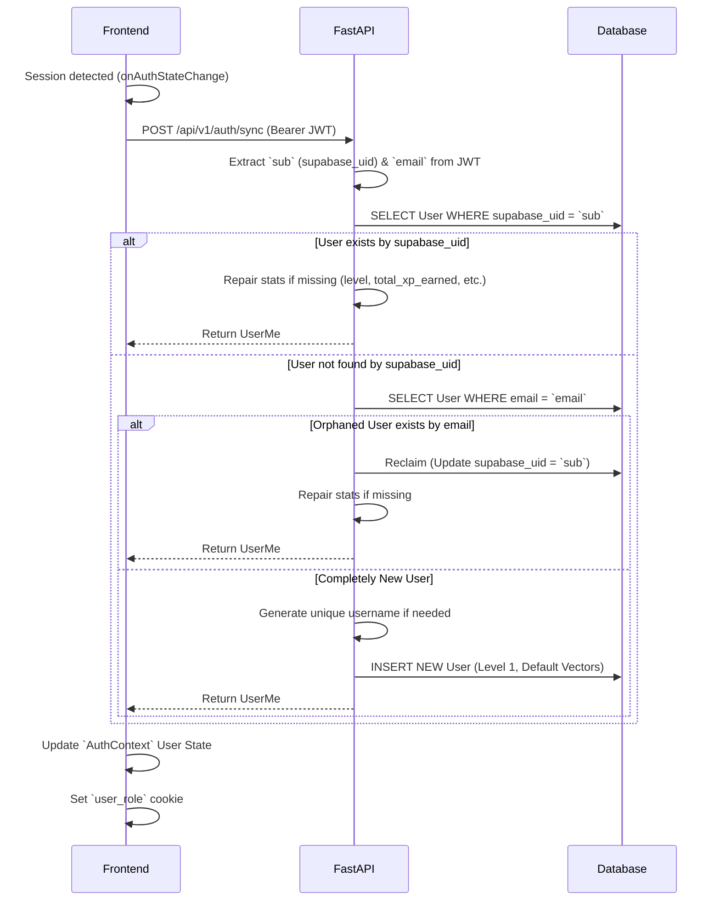

# Authentication & JIT Provisioning Flow

This document details the complete end-to-end authentication lifecycle in TasteMap, covering Registration, Login, and Just-In-Time (JIT) Database Provisioning. TasteMap uses a hybrid approach: **Supabase** handles identity management (JWTs, OAuth, passwords), while our **PostgreSQL** database handles application-specific user data and gamification stats.

## 1. User Registration Flow

The registration process ensures that usernames are unique and emails are verified *before* creating the user in Supabase.

## 2. Login & Username Resolution Flow

TasteMap allows users to log in with either their email or username. Since Supabase only supports email login natively, the frontend must resolve the username to an email first.

## 3. Just-In-Time (JIT) Provisioning Flow

The JIT Provisioning flow bridges Supabase Auth and the FastAPI backend. It ensures that whenever a user logs in (or refreshes their session), a corresponding `User` record exists in the PostgreSQL database with correct default values (vectors, level, XP).

This is triggered automatically in `frontend/src/context/AuthContext.tsx` via `onAuthStateChange` (`INITIAL_SESSION` or `SIGNED_IN`).

## Key Architectural Decisions

1. **No Backend Triggers:** We do *not* use Supabase Postgres triggers to create users. The FastAPI backend is the sole orchestrator of the `users` table via the JIT flow (`/api/v1/auth/sync`).
2. **Resilience:** If the FastAPI backend is temporarily unreachable during session initialization, the frontend falls back to creating a temporary local user object based on the Supabase JWT metadata. This prevents the user from being abruptly logged out.
3. **Orphaned Row Reclaiming:** If a user deletes their Supabase account and signs up again with the same email, the backend identifies the old PostgreSQL row by email and reclaims it by updating the `supabase_uid`.
4. **Vector Initialization:** New users are initialized with a neutral `[0.5] * 15` vector for both food and places, serving as the starting point for the Discovery Swipe learning algorithm.
