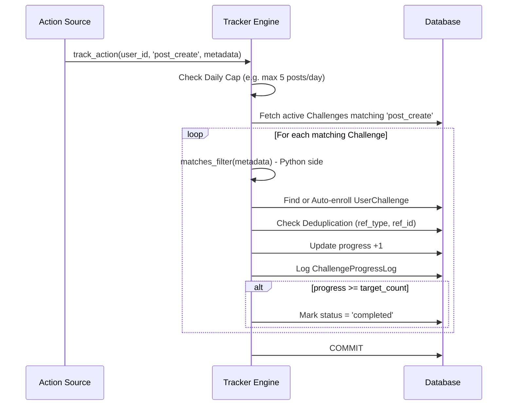

# 🎮 Challenges & Gamification Flow

This document details the business logic, architecture, and workflows for TasteMap's Gamification system, which includes XP & Leveling, the Challenge Tracker, Streaks, and Leaderboards.

## 1. XP & Leveling System (`xp_service.py`)

The XP system tracks user engagement and progression. It distinguishes between **absolute XP** (total earned ever) and **relative XP** (XP earned within the current level).

### Level Up Logic (In-Memory Optimization)

To reduce database load during bulk actions, level calculations are optimized:
1. Fetch the user's current absolute `total_xp_earned`.
2. Add the new `amount`.
3. If `new_total_xp >= next_level_xp`, query all `LevelConfig` rows where `level > current_level`.
4. Iterate through the configs *in RAM* to determine the final level and new threshold.
5. Execute a single atomic SQL `UPDATE` to save `total_xp_earned`, `level`, and `next_level_xp`.
6. Log an `XpTransaction` for audit.

### Redis Dual-Write (Leaderboards)

To ensure high-performance leaderboards, XP transactions are dual-written to Redis using pipelines:
- **All-Time Leaderboard:** Uses `ZADD` with absolute `total_xp_earned`.
- **Monthly/Weekly Leaderboards:** Uses `ZINCRBY` with the incremental `amount`.
- Time-based leaderboards automatically expire via `EXPIRE` to keep Redis clean (e.g., Monthly expires in 60 days).

---

## 2. Challenge Auto-Tracker (`tracker.py`)

The Challenge Tracker is an event-driven engine that monitors user actions and automatically updates challenge progress.

### Key Mechanisms:
- **Daily Caps:** Hard limits on how many times an action can yield points in a single UTC day (e.g., `post_create`: 5, `receive_likes`: 50) to prevent farming.
- **Python-Side Filtering (`matches_filter`):** Evaluates complex rules in RAM rather than complex SQL queries (e.g., `time_after`, `require_photo`, `cuisine_type` matching).
- **Auto-Enrollment (Lazy Creation):** Users do not need to manually "join" a challenge. If they perform a matching action, a `UserChallenge` record is created dynamically.
- **Deduplication:** Uses `ref_type` and `ref_id` (e.g., `post_id`) to ensure a single entity doesn't trigger progress multiple times for the same challenge.

---

## 3. Daily Streak System (`streak_service.py`)

The streak system encourages daily app usage through timezone-aware check-ins.

### Check-in Logic
When a user logs in or explicitly triggers a check-in:
1. **Timezone Adjustments:** The user's local "today" is calculated based on UTC time + `timezone_offset`.
2. **Evaluation:**
   - **Check-in Today:** Return `already_checked_in`, no XP awarded.
   - **Check-in Yesterday:** Increment `current_streak` by 1. Award base XP (10) + Bonus XP (capped at +50 XP).
   - **Check-in Before Yesterday:** Streak broken. Reset `current_streak` to 1. Award base XP (10).
3. **High Score:** Updates `longest_streak` if the current streak exceeds it.
4. **XP Integration:** Calls `xp_service.award_xp` with source `streak_bonus`.
